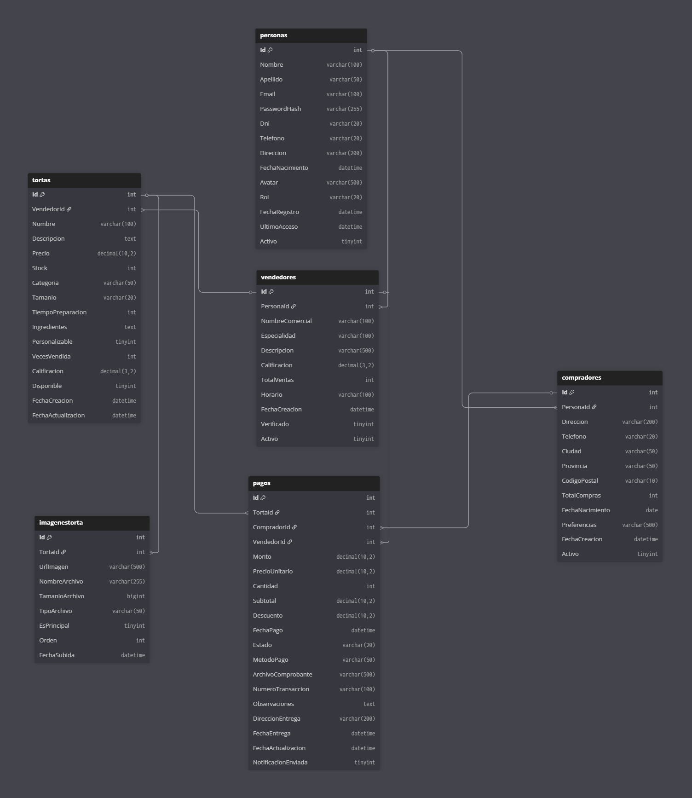

# Casa de las Tortas - Plataforma de Venta de Tortas

  
  
  
  
  ![JWT]
  ![SignalR]
  ![MariaDB]

## Comandos utiles para migraciones

dotnet ef database update 0       # revierte todo
dotnet ef migrations remove       # borra la última migración si hay conflicto
dotnet ef migrations add Inicial     # crea una migración limpia
dotnet ef database update            # aplica todo

## Descripción del Proyecto

**Casa de las Tortas** 
Para esta segunda etapa se planea una plataforma web completa para la gestión y venta de tortas artesanales. El sistema conecta vendedores de tortas con compradores, proporcionando herramientas para la gestión de catálogos, procesamiento de pagos y notificaciones en tiempo real.

### Características Principales

- **Multi-rol**: Sistema con 3 roles diferenciados (Admin, Vendedor, Comprador)
- **Catálogo Visual**: Gestión de tortas con múltiples imágenes
- **Pagos Seguros**: Sistema de pagos con comprobantes y estados
- **Tiempo Real**: Notificaciones instantáneas con SignalR
- **API REST**: API completa con autenticación JWT
- **Dashboard**: Panel de control para vendedores con estadísticas

## Arquitectura y Patrones

- **Arquitectura en Capas**: Controllers → Services → Repositories → Data
- **Repository Pattern**: Abstracción del acceso a datos
- **Unit of Work**: Gestión de transacciones complejas
- **DTO Pattern**: Transferencia segura de datos
- **Dependency Injection**: Inyección de dependencias nativa de .NET

## Modelo de Datos

### Entidades Principales (6)

1. **Persona**: Entidad base para todos los usuarios
2. **Vendedor**: Gestiona catálogo de tortas
3. **Comprador**: Realiza compras
4. **Torta**: Productos del catálogo
5. **ImagenTorta**: Galería de imágenes
6. **Pago**: Transacciones del sistema

### Relaciones
- Persona → Vendedor (1:0..1)
- Persona → Comprador (1:0..1)
- Vendedor → Torta (1:N)
- Torta → ImagenTorta (1:N)
- Comprador → Pago (1:N)
- Vendedor → Pago (1:N)
- Torta → Pago (1:N)

## Requisitos del Sistema

### Software Requerido
- .NET 8.0 SDK o superior
- MariaDB 10.11+ o MySQL 8.0+
- Visual Studio 2022 / VS Code
- Postman (para pruebas de API)
- Node.js 18+ (para Vue.js)

### Paquetes NuGet Principales
- `Microsoft.EntityFrameworkCore` (8.0.0)
- `Pomelo.EntityFrameworkCore.MySql` (8.0.0)
- `Microsoft.AspNetCore.Authentication.JwtBearer` (8.0.0)
- `BCrypt.Net-Next` (4.0.3)
- `Microsoft.AspNetCore.SignalR` (8.0.0)

## Instalación y Configuración

### 1. Clonar el Repositorio
```bash
git clone https://github.com/tu-usuario/casa-de-las-tortas.git
cd casa-de-las-tortas
```

### 2. Configurar Base de Datos

Crear la base de datos en MariaDB/MySQL:
```sql
CREATE DATABASE casaTortas_db;
Nota: Presento la base de datos para que sea importada, pero se puede acceder a la base de datos ejecutar el Create DataBase con el nombre de la base de datos y seguir los pasos que se dejan explicitos a continuacion, como la configuracion de appsettings, y los comandos siguientes
```

### 3. Configurar Connection String

Editar `appsettings.json`:
```json
{
  "Jwt": {
    "Key": "esta_es_una_clave_secreta_muy_segura_de_minimo_32_caracteres_para_jwt",
    "Issuer": "CasaDeLasTortas",
    "Audience": "CasaDeLasTortasUsers",
    "ExpirationHours": 8
  },
  "ConnectionStrings": {
    "DefaultConnection": "Server=localhost;Database=casatortas_db;Uid=root;Pwd=;Port=3306;"
    
  }
}
```

### 4. Aplicar Migraciones

```bash
# Crear migración inicial
dotnet ef migrations add InitialCreate

# Aplicar migraciones
dotnet ef database update
```

### 5. Ejecutar la Aplicación

```bash
dotnet run
```

La aplicación estará disponible en:
- HTTP: `http://localhost:5169`

## 👥 Usuarios de Prueba

El sistema incluye datos semilla con los siguientes usuarios:

| Email                     | Contraseña        | Rol       | Descripción               |
|---------------------------|-------------------|-----------|---------------------------|
| **admin@test.com**        | Admin123!         | Admin     | Administrador del sistema |
| **vendedor1@test.com**    | Password123!      | Vendedor  | Pastelería Dulce Amor     |
| **vendedor2@test.com**    | Password123!      | Vendedor  | Tortas Gourmet            |
| **vendedor3@test.com**    | Password123!      | Vendedor  | El Rincón del Postre      |
| **comprador1@test.com**   | Password123!      | Comprador | María García              |
| **comprador2@test.com**   | Password123!      | Comprador | Juan Pérez                |
| **comprador3@test.com**   | Password123!      | Comprador | Ana Martínez              |

## 🔐 Sistema de Autenticación

### JWT (JSON Web Tokens)

El sistema utiliza JWT para autenticación stateless:

1. Login → POST /api/AuthApi/login → Retorna token JWT
2. Cliente guarda token → localStorage.setItem('authToken', token)
3. Usuario navega → window.location.href = '/Vendedor/DashboardVue'
4. Servidor sirve HTML → Sin autenticación
5. Vue.js se monta → Verifica token en localStorage
6. Vue.js llama API → GET /api/AuthApi/me con header Authorization: Bearer {token}
7. Servidor valida JWT → Retorna datos del usuario
8. Vue.js muestra dashboard → Con datos del usuario
   ```

## 📁 Estructura del Proyecto

```
CasaDeLasTortas/
│
├── Controllers/               # Controladores MVC y API
│   ├── AccountController.cs   # Login y registro
│   ├── PersonaController.cs   # CRUD Personas
│   ├── VendedorController.cs  # CRUD Vendedores
│   ├── CompradorController.cs # CRUD Compradores
│   ├── TortaController.cs     # CRUD Tortas
│   ├── PagoController.cs      # CRUD Pagos
│   ├── ImagenTortaController.cs # Gestión imágenes
│   └── Api/                   # Controladores API REST
│
├── Models/
│   ├── Entities/              # Entidades del dominio
│   ├── ViewModels/            # Modelos para vistas
│   └── DTOs/                  # Objetos de transferencia
│
├── Data/
│   ├── ApplicationDbContext.cs # Contexto EF Core
│   └── DbInitializer.cs       # Datos semilla
│
├── Repositories/              # Patrón Repository
│   ├── PersonaRepository.cs
│   ├── VendedorRepository.cs
│   ├── CompradorRepository.cs
│   ├── TortaRepository.cs
│   ├── ImagenTortaRepository.cs
│   ├── PagoRepository.cs
│   └── UnitOfWork.cs          # Coordinador de repos
│
├── Services/                  # Lógica de negocio
│   ├── AuthService.cs         # Autenticación
│   ├── JwtService.cs          # Gestión JWT
│   └── FileService.cs         # Manejo archivos
│
├── Helpers/                   # Utilidades
│   ├── PaginacionHelper.cs    # Paginación genérica
│   └── JwtHelper.cs           # Utilidades JWT
│
├── Middleware/
│   └── JwtMiddleware.cs       # Validación de tokens
│
├── Hubs/
│   └── NotificationHub.cs     # SignalR WebSockets
│
├── wwwroot/                   # Archivos estáticos
│   ├── uploads/               # Archivos subidos
│   │   ├── avatars/          # Avatares usuarios
│   │   ├── tortas/           # Imágenes tortas
│   │   └── comprobantes/     # Comprobantes pago
│   ├── js/                   # JavaScript
│   └── css/                  # Estilos
│
└── Program.cs                 # Configuración principal
```

## API REST Endpoints

### Autenticación
- `POST /api/auth/login` - Iniciar sesión
- `POST /api/auth/register` - Registrar usuario
- `POST /api/auth/refresh` - Renovar token
- `POST /api/auth/logout` - Cerrar sesión

### Personas
- `GET /api/persona` - Listar personas (paginado)
- `GET /api/persona/{id}` - Obtener persona
- `POST /api/persona` - Crear persona
- `PUT /api/persona/{id}` - Actualizar persona
- `DELETE /api/persona/{id}` - Eliminar persona

### Tortas
- `GET /api/torta` - Listar tortas (paginado)
- `GET /api/torta/search?q={busqueda}` - Buscar tortas
- `GET /api/torta/categoria/{categoria}` - Por categoría
- `GET /api/torta/vendedor/{vendedorId}` - Por vendedor
- `POST /api/torta` - Crear torta [Vendedor]
- `PUT /api/torta/{id}` - Actualizar torta [Dueño]
- `DELETE /api/torta/{id}` - Eliminar torta [Dueño]

### Pagos
- `GET /api/pago` - Listar pagos
- `GET /api/pago/{id}` - Obtener pago
- `POST /api/pago` - Crear pago
- `PUT /api/pago/{id}/estado` - Cambiar estado
- `DELETE /api/pago/{id}` - Cancelar pago

##  Documentación API

La colección completa de Postman está disponible en:
```
CasaDeLasTortas_API_JWT_postman_collection.json
```

### Importar en Postman:
1. Abrir Postman
2. Click en "Import"
3. Seleccionar el archivo `.json`
4. La colección incluye:
   - Variables de entorno
   - Autenticación automática
   - Todos los endpoints
   - Ejemplos de request/response


## SignalR - Notificaciones en Tiempo Real

### Configuración Cliente
```javascript
const connection = new signalR.HubConnectionBuilder()
    .withUrl("/hubs/notifications")
    .build();

connection.on("NuevoPago", (pago) => {
    console.log("Nuevo pago recibido:", pago);
});

connection.start();
```

### Eventos Disponibles
- `NuevoPago` - Notifica al vendedor
- `EstadoPago` - Cambio de estado
- `NuevaTorta` - Nueva torta publicada
- `StockBajo` - Alerta de stock


## Tecnologías Utilizadas

- **Backend**: ASP.NET Core 8.0 MVC
- **ORM**: Entity Framework Core 8.0
- **Base de Datos**: MariaDB/MySQL
- **Autenticación**: JWT Bearer
- **Tiempo Real**: SignalR
- **Frontend**: Razor Views + Vue.js 3 
- **Estilos**: Bootstrap 5
- **Validación**: Data Annotations
- **Logging**: ILogger
- **Documentación API**: Postman

## Consideraciones de Seguridad

1. **Contraseñas**: Hasheadas con BCrypt (salt rounds: 10)
2. **JWT**: Tokens con expiración de 8 horas
3. **CORS**: Configurado para producción
4. **HTTPS**: Obligatorio en producción
5. **Validación**: Doble (cliente y servidor)
6. **SQL Injection**: Prevenido con EF Core
7. **XSS**: Prevenido con Razor encoding

## Contribuciones

Este proyecto fue desarrollado como trabajo final

### Equipo
- **Desarrollador**: [Troncoso Leandro]
- **Materia**: Laboratorio II - ASP.NET Core MVC
- **Institución**: [Universidad de la Punta ]
- **Año**: 2025

## Licencia

Este proyecto es de uso educativo.
Proyecto para Promocionar Laboratorio II
Profesor Mariano Luzza


🎂 Casa de las Tortas - Dulzura a un Click de Distancia 🎂
  
Desarrollado usando ASP.NET Core
