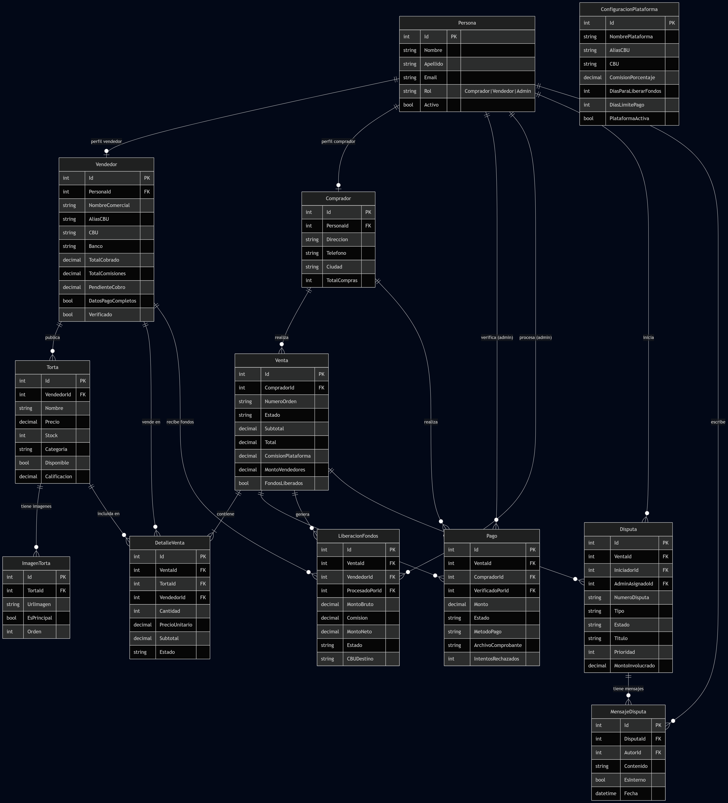

# Casa de las Tortas

Plataforma web de marketplace para la venta de tortas artesanales, desarrollada como trabajo final de Laboratorio II.

**Desarrollador:** Troncoso Leandro  
**Materia:** Laboratorio II — ASP.NET Core MVC  
**Institución:** Universidad de la Punta  
**Año:** 2025  
**Profesor:** Mariano Luzza

---

## Descripción del Proyecto

Casa de las Tortas es un marketplace multi-rol donde vendedores publican sus tortas artesanales y compradores pueden explorar el catálogo, armar su carrito y realizar compras. El administrador gestiona pagos, liberaciones de fondos, disputas y reembolsos.

### Roles del sistema

| Rol | Acceso |
|---|---|
| **Admin** | Panel de administración completo (MVC + Razor): verificación de pagos, liberación de fondos a vendedores, gestión de disputas y reembolsos, reportes |
| **Vendedor** | Dashboard Vue.js: publicación y gestión de tortas (ABM completo), seguimiento de pedidos, estadísticas de ventas, cobros |
| **Comprador** | Dashboard Vue.js: catálogo con búsqueda, carrito de compras, historial de órdenes, disputas |

---

## Diagrama de Entidad-Relación



---

## Cumplimiento de Requisitos Mínimos

### 1. Al menos 4 clases/tablas relacionadas con relación 1 a muchos

El modelo tiene 12 entidades relacionadas entre sí:

| Entidad | Relación | Descripción |
|---|---|---|
| `Persona` → `Vendedor` | 1:0..1 | Una persona puede ser vendedor |
| `Persona` → `Comprador` | 1:0..1 | Una persona puede ser comprador |
| `Vendedor` → `Torta` | 1:N | Un vendedor publica muchas tortas |
| `Torta` → `ImagenTorta` | 1:N | Una torta tiene múltiples imágenes |
| `Comprador` → `Venta` | 1:N | Un comprador realiza muchas ventas |
| `Venta` → `DetalleVenta` | 1:N | Una venta tiene muchos ítems |
| `Venta` → `Pago` | 1:1 | Cada venta tiene su pago |
| `Venta` → `Liberacion` | 1:N | Por venta se generan liberaciones por vendedor |
| `Venta` → `Disputa` | 1:N | Una venta puede tener disputas |
| `Disputa` → `MensajeDisputa` | 1:N | Una disputa tiene historial de mensajes |
| `Comprador` → `Carrito` | 1:1 | Cada comprador tiene un carrito persistente |
| `Carrito` → `ItemCarrito` | 1:N | Un carrito tiene múltiples ítems |

**Archivos:** `Models/Entities/`

---

### 2. Seguridad con login, Authorize, roles y avatar

**Login (doble mecanismo):**
- **Cookie** (MVC tradicional): `AccountController.Login()` — para el panel admin y vistas Razor
- **JWT** (API): `POST /api/AuthApi/login` — para los dashboards Vue del Vendedor y Comprador

**Authorize por rol:**
```csharp
// Ejemplos en el código
[Authorize(Roles = "Admin")]                    // AdminController
[Authorize(Roles = "Vendedor")]                 // VendedorController.Perfil()
[Authorize(AuthenticationSchemes = JwtBearerDefaults.AuthenticationScheme, Roles = "Admin")]
[Authorize(AuthenticationSchemes = JwtBearerDefaults.AuthenticationScheme, Roles = "Vendedor")]
[Authorize(AuthenticationSchemes = JwtBearerDefaults.AuthenticationScheme, Roles = "Comprador")]
```

**Avatar:** campo `Avatar` en la entidad `Persona`, subido con `IFormFile` a `wwwroot/uploads/avatars/`. Se muestra en el sidebar del admin y en los dashboards Vue.

**Archivos:** `Controllers/AccountController.cs`, `Controllers/Api/AuthApiController.cs`, `Middleware/JwtMiddleware.cs`

---

### 3. Uso de archivos (adicional al avatar)

| Archivo | Dónde se sube | Endpoint |
|---|---|---|
| Imágenes de tortas | `wwwroot/uploads/tortas/` | `POST /api/ImagenTortaApi/multiple` |
| Comprobante de pago | `wwwroot/uploads/comprobantes/` | `POST /api/PagoApi/{id}/comprobante` |
| Comprobante de liberación | `wwwroot/uploads/liberaciones/` | `POST /api/LiberacionApi/{id}/procesar-transferencia` |
| Comprobante de reembolso | `wwwroot/uploads/reembolsos/` | `POST /Admin/ProcesarReembolso` |

Todos los uploads usan `IFormFile` con validación de tipo y tamaño a través de `IFileService`.

**Archivos:** `Services/FileService.cs`, `Interfaces/IFileService.cs`

---

### 4. ABM completo con Vue.js y funcionalidad vía AJAX

**MisTortas.vue (Vendedor) — CRUD completo de tortas:**

| Operación | Endpoint API |
|---|---|
| Listar mis tortas | `GET /api/VendedorApi/{id}/tortas` |
| Crear torta | `POST /api/TortaApi` |
| Editar torta | `PUT /api/TortaApi/{id}` |
| Cambiar disponibilidad | `PATCH /api/TortaApi/{id}/disponibilidad` |
| Eliminar torta | `DELETE /api/TortaApi/{id}` |
| Subir imágenes | `POST /api/ImagenTortaApi/multiple` |

Todas las operaciones usan `fetchWithAuth()` con el token JWT almacenado en `localStorage`. No hay recarga de página.

**Archivo:** `ClientApp/vendedor/components/MisTortas.vue`

---

### 5. Listados con paginado del lado del servidor

El paginado se implementa con `Skip/Take` **antes** del `ToListAsync()`, es decir en la query SQL — no se traen todos los registros.

**MVC (Razor):**
- `HomeController.Index()` — catálogo público, paginado con `PaginacionViewModel`
- `AdminController.Usuarios()` — llama `PersonaRepository.GetAllConPerfilesAsync(pagina, tamaño, filtros)` que ejecuta `Skip/Take` en EF Core
- `AdminController.Pagos()`, `Ventas()`, `Liberaciones()`, `Disputas()` — mismo patrón

**Implementación en repositorio:**
```csharp
// PersonaRepository.cs — Skip/Take ANTES del ToListAsync
return await query
    .OrderByDescending(p => p.FechaRegistro)
    .Skip((pagina - 1) * registrosPorPagina)
    .Take(registrosPorPagina)
    .ToListAsync();
```

**Componentes de paginación:** `Views/Shared/_Paginacion.cshtml`, `Views/Shared/_PaginacionPartial.cshtml`

**API con paginado:**
- `GET /api/AdminApi/usuarios?pagina=1&tamanioPagina=10`
- `GET /api/PersonaApi?pagina=1&registrosPorPagina=10`
- `GET /api/TortaApi?pagina=1&registrosPorPagina=10`
- `GET /api/DisputaApi?pagina=1&registrosPorPagina=10`

---

### 6. Búsqueda AJAX al seleccionar entidades relacionadas

Al buscar tortas para agregar al carrito, el sistema llama la API por cada input del usuario (con debounce), sin cargar todos los registros previamente.

**CatalogoComprador.vue y MisTortas.vue:**
```javascript
// Debounce 400ms — solo llama la API al escribir >= 2 caracteres
function onBusqueda() {
  clearTimeout(timerBusqueda)
  if (terminoBusqueda.value.length < 2) return
  timerBusqueda = setTimeout(buscarTortas, 400)
}

async function buscarTortas() {
  const data = await fetchWithAuth(
    `/api/TortaApi/search?termino=${encodeURIComponent(terminoBusqueda.value)}`
  )
}
```

El endpoint `GET /api/TortaApi/search?termino=` retorna solo los resultados que coinciden con el término.

**Archivos:** `ClientApp/comprador/components/CatalogoComprador.vue`, `ClientApp/vendedor/components/MisTortas.vue`

---

### 7. Uso de API con JWT

El sistema tiene una API REST completa con autenticación JWT:

**Obtener token:**
```
POST /api/AuthApi/login
Body: { "email": "vendedor1@test.com", "password": "Password123!" }
Response: { "token": "eyJ...", "expiracion": "..." }
```

**Usar token:**
```
Authorization: Bearer eyJ...
```

Los dashboards de Vendedor y Comprador (Vue.js) usan exclusivamente JWT almacenado en `localStorage`. El JwtMiddleware también acepta el token por query string (`?access_token=`) para descargas de archivos como facturas.

**Colección Postman:** `CasaDeLasTortas_API_JWT_postman_collection.json`

---

## Modelo de Datos Completo

```
Persona (id, nombre, apellido, email, passwordHash, telefono, dni, direccion, 
         fechaNacimiento, avatar, rol, activo, fechaRegistro)
  ├── Vendedor (id, personaId, nombreComercial, especialidad, descripcion,
  │             aliasCBU, CBU, banco, titularCuenta, verificado, activo)
  │     └── Torta (id, vendedorId, nombre, descripcion, categoria, precio,
  │                stock, disponible, tamanio, tiempoPreparacion, personalizable)
  │           └── ImagenTorta (id, tortaId, urlImagen, esPrincipal, orden)
  └── Comprador (id, personaId, activo, totalCompras, fechaCreacion)
        ├── Carrito (id, compradorId)
        │     └── ItemCarrito (id, carritoId, tortaId, cantidad, notas)
        └── Venta (id, compradorId, numeroOrden, total, estado, fechaVenta)
              ├── DetalleVenta (id, ventaId, tortaId, vendedorId, cantidad,
              │                 precioUnitario, subtotal, estado)
              ├── Pago (id, ventaId, monto, estado, metodoPago,
              │         archivoComprobante, numeroTransaccion)
              ├── Liberacion (id, ventaId, vendedorId, montoNeto, estado,
              │               numeroOperacion, archivoComprobante)
              └── Disputa (id, ventaId, iniciadorId, tipo, estado, resolucion)
                    └── MensajeDisputa (id, disputaId, autorId, contenido, fecha)
```

---

## Tecnologías

| Capa | Tecnología |
|---|---|
| Backend | ASP.NET Core 8.0 MVC |
| ORM | Entity Framework Core 8.0 |
| Base de datos | MariaDB / MySQL |
| Autenticación MVC | Cookie Authentication |
| Autenticación API | JWT Bearer |
| Tiempo real | SignalR (NotificationHub) |
| Frontend admin | Razor Views + Bootstrap 5 |
| Frontend vendedor/comprador | Vue.js 3 (Composition API, script setup) |
| Bundler Vue | Vite |
| Iconos | Font Awesome 6 |
| Contraseñas | BCrypt.Net |
| Arquitectura | Repository Pattern + Unit of Work + DI |

---

## Instalación

### Requisitos
- .NET 8.0 SDK
- MariaDB 10.11+ o MySQL 8.0+
- Node.js 18+

### Pasos

**1. Clonar el repositorio**
```bash
git clone <url-del-repositorio>
cd Tortas_Troncoso_leandro/CasaDeLasTortas
```

**2. Configurar `appsettings.json`**
```json
{
  "ConnectionStrings": {
    "DefaultConnection": "Server=localhost;Database=casatortas_db;Uid=root;Pwd=;Port=3306;"
  },
  "Jwt": {
    "Key": "esta_es_una_clave_secreta_muy_segura_de_minimo_32_caracteres_para_jwt",
    "Issuer": "CasaDeLasTortas",
    "Audience": "CasaDeLasTortasUsers",
    "ExpirationHours": 8
  }
}
```

**3. Aplicar migraciones y seed**
```bash
dotnet ef database update
```
La base de datos se inicializa automáticamente con datos de prueba al primer arranque (`DbInitializer.cs`).

**4. Compilar Vue.js**
```bash
cd ClientApp
npm install
npm run build
```

**5. Ejecutar**
```bash
cd ..
dotnet run
```

Disponible en: `http://localhost:5169`

### Comandos útiles para migraciones
```bash
dotnet ef database update 0       # revertir todo
dotnet ef migrations remove       # borrar última migración
dotnet ef migrations add Inicial  # crear migración
dotnet ef database update         # aplicar
```

---

## Usuarios de Prueba

| Email | Contraseña | Rol |
|---|---|---|
| admin@test.com | Admin123! | Admin |
| vendedor1@test.com | Password123! | Vendedor — Pastelería Dulce Amor |
| vendedor2@test.com | Password123! | Vendedor — Tortas Gourmet |
| vendedor3@test.com | Password123! | Vendedor — El Rincón del Postre |
| comprador1@test.com | Password123! | Comprador — María García |
| comprador2@test.com | Password123! | Comprador — Juan Pérez |
| comprador3@test.com | Password123! | Comprador — Ana Martínez |

---

## Endpoints API Principales

### Autenticación
```
POST   /api/AuthApi/login              Obtener token JWT
POST   /api/AuthApi/register           Registrar usuario
GET    /api/AuthApi/me                 Datos del usuario actual
POST   /api/AuthApi/logout             Cerrar sesión
```

### Tortas
```
GET    /api/TortaApi                   Listar (paginado)
GET    /api/TortaApi/disponibles       Catálogo público
GET    /api/TortaApi/search?termino=   Búsqueda AJAX
GET    /api/TortaApi/{id}              Detalle
POST   /api/TortaApi                   Crear [Vendedor]
PUT    /api/TortaApi/{id}              Editar [Vendedor]
PATCH  /api/TortaApi/{id}/disponibilidad  Cambiar estado
DELETE /api/TortaApi/{id}              Eliminar [Vendedor]
```

### Ventas
```
GET    /api/VentaApi/mis-compras       Historial comprador
POST   /api/VentaApi/desde-carrito     Crear venta desde carrito
GET    /api/VentaApi/{id}              Detalle de venta
POST   /api/VentaApi/{id}/cancelar     Cancelar
```

### Carrito
```
GET    /api/CarritoApi                 Ver carrito
POST   /api/CarritoApi/agregar         Agregar ítem
PUT    /api/CarritoApi/actualizar      Cambiar cantidad
DELETE /api/CarritoApi/quitar          Quitar ítem
DELETE /api/CarritoApi/vaciar          Vaciar
```

### Pagos
```
POST   /api/PagoApi/{id}/comprobante   Subir comprobante [Comprador]
GET    /api/PagoApi/pendientes-verificacion  [Admin]
PATCH  /api/PagoApi/{id}/verificar     Aprobar/rechazar [Admin]
GET    /api/PagoApi/reembolsos-pendientes    [Admin]
POST   /api/PagoApi/{id}/reembolso     Registrar reembolso [Admin]
```

### Liberaciones
```
GET    /api/LiberacionApi/listas-para-liberar  [Admin]
POST   /api/LiberacionApi/{id}/procesar-transferencia  [Admin]
```

### Disputas
```
POST   /api/DisputaApi                 Abrir disputa
GET    /api/DisputaApi/{id}/mensajes   Ver mensajes
POST   /api/DisputaApi/{id}/mensajes   Agregar mensaje
POST   /api/DisputaApi/{id}/resolver   Resolver [Admin]
```

### Admin
```
GET    /api/AdminApi/dashboard         Resumen general
GET    /api/AdminApi/usuarios          Listado paginado con filtros
GET    /api/AdminApi/vendedores        Con filtros
GET    /api/AdminApi/ventas            Con filtros y paginado
GET    /api/AdminApi/reportes          Con rango de fechas
```

---

## Notificaciones en Tiempo Real (SignalR)

Hub: `/hubs/notifications`

| Evento | Receptor | Descripción |
|---|---|---|
| `PedidoListo` | Comprador | Un ítem de su pedido está listo para retirar |
| `PagoVerificado` | Comprador | El admin aprobó su comprobante de pago |
| `PagoRechazado` | Comprador | El admin rechazó su comprobante de pago |

**Archivo:** `Hubs/NotificationHub.cs`

---

## Estructura del Proyecto

```
CasaDeLasTortas/
├── Controllers/
│   ├── AccountController.cs       Login/registro (Cookie)
│   ├── AdminController.cs         Panel admin (Razor + MVC)
│   ├── VendedorController.cs      Shell Vue vendedor
│   ├── CompradorController.cs     Shell Vue comprador
│   ├── VentaController.cs         Factura PDF
│   └── Api/                       REST API (JWT)
│       ├── AuthApiController.cs
│       ├── TortaApiController.cs
│       ├── VentaApiController.cs
│       ├── CarritoApiController.cs
│       ├── PagoApiController.cs
│       ├── LiberacionApiController.cs
│       ├── DisputaApiController.cs
│       ├── DetalleVentaApiController.cs
│       ├── VendedorApiController.cs
│       ├── AdminApiController.cs
│       └── ConfiguracionApiController.cs
├── Models/
│   ├── Entities/                  Entidades EF Core
│   ├── ViewModels/                Modelos para vistas Razor
│   └── DTOs/                      Objetos de transferencia de datos
├── Repositories/                  Patrón Repository
├── Services/                      Lógica de negocio
├── Hubs/NotificationHub.cs        SignalR
├── Middleware/JwtMiddleware.cs     Validación JWT
├── Data/
│   ├── ApplicationDbContext.cs
│   └── DbInitializer.cs           Datos semilla
├── ClientApp/                     Vue.js 3 + Vite
│   ├── vendedor/                  SPA Vendedor
│   └── comprador/                 SPA Comprador
└── wwwroot/
    ├── uploads/avatars/
    ├── uploads/tortas/
    ├── uploads/comprobantes/
    └── uploads/liberaciones/
```

---

## Seguridad

- Contraseñas hasheadas con **BCrypt** (salt rounds: 12)
- Tokens JWT con expiración de **8 horas**
- Doble validación: Data Annotations (servidor) + validación cliente
- Protección CSRF con `[ValidateAntiForgeryToken]` en formularios MVC
- SQL Injection prevenido por EF Core (queries parametrizadas)
- XSS prevenido por Razor encoding automático
- Archivos subidos validados por extensión y tamaño

---

*Casa de las Tortas *

Comparativa
Aspecto	                  Con Venta                 	Sin Venta (solo DetalleVenta)
Número de orden	            Una por Venta	            Múltiples por compra (uno por detalle)
Dirección de entrega	      Una sola	                Una por cada torta (podría ser diferente)
Estado general	      Un estado para toda la compra	   Estados independientes por producto
Pago	                Un pago por Venta	               Múltiples pagos (uno por detalle)
Comisión	            Una por Venta	                  Una por DetalleVenta
Disputa	              Una disputa por Venta           	Una disputa por DetalleVenta
